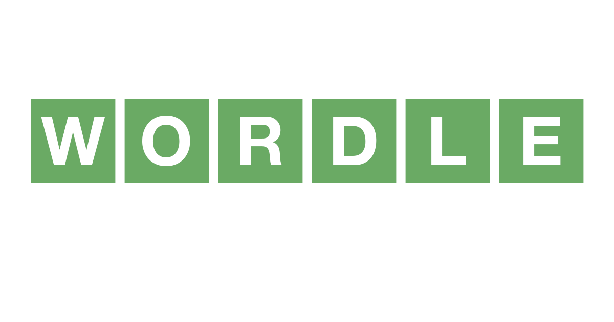

# Welcome to my [Wordle](https://www.nytimes.com/games/wordle/index.html) solver! (v3)

## Use:

_Note: The aim of the reccomended words is to cut down the list of possible words as quickly as possible. \
The reccomended word will not be the final answer._

The final answer will be displayed in the list of possible words.

- You'll first be shown a list of all possible words
- You will then be given a 'best guess' word to cut down this list
- Some of the words in this list aren't valid in wordle. So there is a y/n prompt for if a word is valid
- If a word is invalid, you'll be given a new reccomendation
- Once you've found a valid word, input the 5 results as follows (e.g. 'nymmn'):
  - y: yes. (a green letter)
  - n: no (a grey letter)
  - m: maybe (a yellow letter)
- Keep going with these reccomendations until your possible word list is small
- You can use your judgement to select from the possible word list your answer
